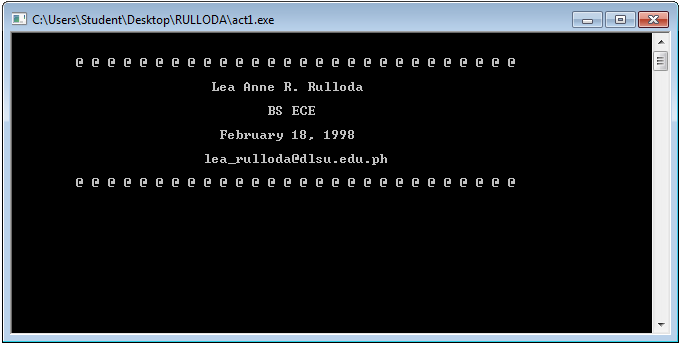
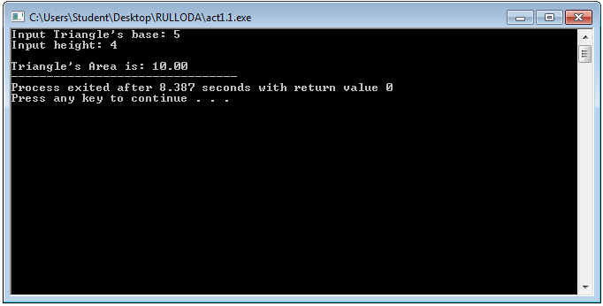

# Activity1-RullodaL
```
#include <stdio.h>
#include <stdlib.h>

int main() {
	printf("\n\n\t@ @ @ @ @ @ @ @ @ @ @ @ @ @ @ @ @ @ @ @ @ @ @ @ @ @ @ @\n\n");
	printf("\t\t\t Lea Anne R. Rulloda\n\n");
	printf("\t\t\t\tBS ECE\n\n");
	printf("\t\t\t  February 18, 1998\n\n");
	printf("\t\t\tlea_rulloda@dlsu.edu.ph\n\n");
	printf("\t@ @ @ @ @ @ @ @ @ @ @ @ @ @ @ @ @ @ @ @ @ @ @ @ @ @ @ @");
	getch();
	return 0;
}
```

```
#include <stdio.h>
#include <stdlib.h>

int main() {
	float base,height,area;
	printf("Input Triangle's base: ");
	scanf("%f",&base);
	printf("Input height: ");
	scanf("%f",&height);
	area=0.5*base*height;
	printf("\nTriangle's Area is: %.2f",area);
	return 0;
}
```

